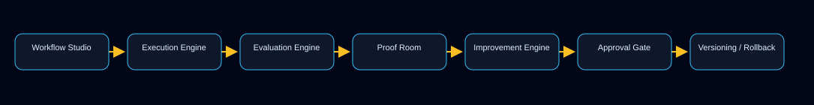

# Proof Gradient · GoalOS

       

**Aim. Act. Prove. Evolve.**

> A model can answer. An agent can act. An institution must prove.

Proof Gradient is the public proof and standards layer. GoalOS is the recursive workflow operating layer. QUEBEC.AI ⚜️✨ is the sovereign Québec AI identity layer.

**Category:** Recursive Self-Improving Workflows.  
**Platform direction:** GoalOS Recursive Workflow OS.  
**Commercial line:** ChatGPT gives you answers. GoalOS gives you workflows that get better every time they run.  
**Enterprise line:** Enterprise RSI without model self-modification.

## Safe AI boundary

GoalOS improves workflows around AI; it does not modify base AI models. GoalOS improves instructions, prompts, memory, scorecards, proof records, evaluations, approvals, versions, monitoring, and rollback around AI systems.

French: GoalOS ne modifie pas les modèles IA de base. GoalOS améliore les flux autour de l’IA grâce aux instructions, prompts, mémoire, grilles de score, dossiers de preuve, évaluations, approbations, versions, surveillance et rollback.

**Core law:** No proof, no evolution. No eval, no propagation. No rollback, no release.  
**Français:** Pas de preuve, pas d’évolution. Pas d’évaluation, pas de propagation. Pas de rollback, pas de publication.

**Core loop:** Run → Score → Prove → Diagnose → Improve → Approve → Version → Monitor → Re-run.


## Product ladder

Paid products and gated applications are sold through the QUEBEC.AI shop only: <https://www.quebecartificialintelligence.com/shop>. Buyer files, implementation bundles, and private delivery kits must not be uploaded to GitHub Pages.

| Layer | Offer | Outcome | Status |
|---|---|---|---|
| Self-serve | $49 AI Efficiency Sprint Kit v1.4 | Build one reusable AI workflow.<br><em>Construisez un flux IA réutilisable.</em> | Ready |
| Self-serve | $199 RSI Lite v1.6 | Build one self-improving AI workflow.<br><em>Construisez un flux IA auto-améliorant.</em> | Ready |
| Self-serve / department | $997 Proof Room Lite / Department Pack v2.0 | Set up a lightweight department Proof Room.<br><em>Mettez en place une Salle de preuve légère pour un département.</em> | Ready |
| Gated workshop | $2,500+ RSI Sprint Workshop v7.0 | Build the first self-improving workflow live.<br><em>Construisez le premier flux auto-améliorant en direct.</em> | Ready |
| Gated implementation | $9,500+ Proof Room Implementation Sprint v2.0 | Department RSI in 30 days.<br><em>RSI départemental en 30 jours.</em> | Ready |
| Gated enterprise | $49,000+ Enterprise RSI Pilot v2.0 | Pilot the Recursive Workflow OS.<br><em>Pilotez le Recursive Workflow OS.</em> | Ready as pilot |

Current status: product/service packages are ready to sell, first public proof is still needed, and GoalOS Cloud is an MVP software proof rather than a complete SaaS. The next milestone is **Proof Card 001**.

## Public standards

The AEP standards are the public trust layer for evolution evidence, proof packets, permissions, rollback receipts, public-safe reports, and Proof Rooms.

- **AEP-001** — GoalOS Proof-of-Evolution Constitution
- **AEP-002** — Evidence Docket Standard
- **AEP-003** — ProofPacket Schema
- **AEP-004** — Selection Gate Standard
- **AEP-005** — Tool Permission Standard
- **AEP-006** — Rollback Receipt Standard
- **AEP-007** — Public-Safe Proof Report Standard
- **AEP-008** — Proof Room Standard

## Platform architecture

GoalOS Recursive Workflow OS organizes repeated AI work into scored, versioned, approved, monitored, rollback-capable workflow assets.

- Workflow Studio defines the job, instructions, memory policy, and success criteria.
- Execution and Evaluation Engines run the workflow and score outputs.
- Proof Room records evidence, scorecards, and approval state.
- Improvement Engine proposes changes.
- Approval Gate, Versioning, Monitoring, and Rollback keep releases proof-bounded.



## Software proof: GoalOS Cloud MVP 0.2

GoalOS Cloud MVP 0.2 lives in `site/app/goalos-cloud-mvp/`. It is a public static software proof, not a full production SaaS. It demonstrates workflow versioning, evaluation, proof records, improvement proposals, approval gates, rollback targets, proof-card export, and Proof Graph export in a browser-local environment.

## Public site and validation system

The public site is deployed from `site/` through GitHub Pages. The current validation architecture is **GoalOS Validation Hotfix v14 Microsite Compatibility**.

- Canonical pages require the canonical shell and footer.
- Standalone proof/microsite pages do not require the normal marketing shell; new pages should add standalone proof metadata and an escape link.
- App pages under `site/app/goalos-cloud-mvp/` may use the app shell.
- Public AEP packages are allowed only at `standards/AEP-###/complete-package.zip`.
- Paid/private artifacts are blocked by the paid-file guard.
- v12 and v13 validation workflows are obsolete; use v14.

## Repository map

| Path | Purpose |
|---|---|
| `docs/` | Public documentation, release notes, policies, and operating summaries. |
| `docs/data/goalos_catalog.yml` | Source of truth for product ladder, statuses, claims, figures, tables, and validation. |
| `docs/figures/` | Mermaid sources and SVG exports for public diagrams. |
| `docs/tables/` | CSV tables that markdown docs must match. |
| `badges/` | Static GitHub-safe SVG badges. |
| `site/` | GitHub Pages public site and GoalOS Cloud MVP static app. |
| `schemas/` | Public schemas for Proof Gradient / GoalOS artifacts. |
| `scripts/` | Validation, release, and site automation scripts. |
| `tests/` | Regression tests for product catalog, public site rules, safety, and proof behavior. |

## Documentation map

Start with [`docs/GOALOS_DOCUMENTATION_INDEX.md`](docs/GOALOS_DOCUMENTATION_INDEX.md), then use:

- [`docs/GOALOS_PRODUCT_LADDER.md`](docs/GOALOS_PRODUCT_LADDER.md)
- [`docs/GOALOS_RECURSIVE_WORKFLOW_OS.md`](docs/GOALOS_RECURSIVE_WORKFLOW_OS.md)
- [`docs/GOALOS_CLOUD_MVP_0_2.md`](docs/GOALOS_CLOUD_MVP_0_2.md)
- [`docs/GOALOS_VALIDATION_HOTFIX_V14.md`](docs/GOALOS_VALIDATION_HOTFIX_V14.md)
- [`docs/GOALOS_PAID_ARTIFACT_POLICY.md`](docs/GOALOS_PAID_ARTIFACT_POLICY.md)
- [`docs/GOALOS_CLAIMS_AND_SAFE_BOUNDARY.md`](docs/GOALOS_CLAIMS_AND_SAFE_BOUNDARY.md)
- [`docs/GOALOS_PROOF_CARD_001_PLAN.md`](docs/GOALOS_PROOF_CARD_001_PLAN.md)

Figures are in [`docs/figures/`](docs/figures/). Tables are in [`docs/tables/`](docs/tables/).

## Claim boundary

This repository does not claim guaranteed ROI, guaranteed revenue, guaranteed productivity, investment returns, legal advice, financial advice, tax advice, compliance certification, AI safety certification, model self-modification, uncontrolled autonomous deployment, achieved AGI/ASI, or real-world superintelligence deployment.

## Paid-file policy

Buyer products are sold through the QUEBEC.AI shop and must not be uploaded to GitHub Pages. Public GitHub Pages may include public standards, docs, schemas, examples, proof pages, site assets, and public AEP packages matching `standards/AEP-###/complete-package.zip`. All other ZIPs in public deploy roots are blocked unless explicitly reviewed and added to a narrow public allowlist.

## Run validation

```bash
python scripts/validate_goalos_public_site.py
python scripts/check_no_paid_artifacts.py
python scripts/validate_docs_tables_figures.py
python scripts/validate_goalos_catalog.py
```

## Run tests

```bash
pytest
make test
node site/app/goalos-cloud-mvp/tests/enterprise-core.test.mjs
```

If a local environment lacks a tool, record the skipped check in `docs/GOALOS_REPO_AUDIT.md` and keep dependency-free validation passing.

## Release-safety status

- Public proof/standards layer: active.
- GoalOS product/service ladder: ready to sell through the shop; first public proof still needed.
- GoalOS Cloud MVP 0.2: public software proof; full SaaS is not complete.
- Current validation: Hotfix v14.
- Next milestone: Proof Card 001.

## License and contribution

See [`LICENSE`](LICENSE), [`CONTRIBUTING.md`](CONTRIBUTING.md), [`SECURITY.md`](SECURITY.md), and [`ROADMAP.md`](ROADMAP.md).
