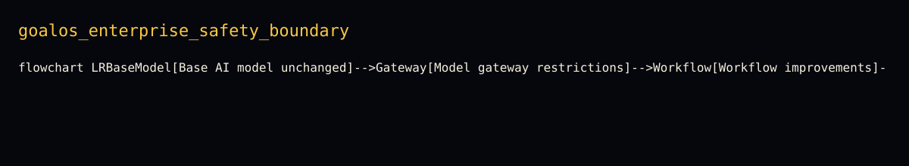

# GoalOS Claims and Safe Boundary

## Purpose

Make claim limits operational for docs, site, and sales-facing public copy.

## Current status

Proof-bounded claims are required across README, docs, site, and tables.

## Key decisions

Allowed: workflow-layer improvement, human approval, versioning, rollback, public-safe proof. Blocked: guaranteed ROI, legal/financial/tax advice, compliance certification, AI safety certification, model self-modification, uncontrolled autonomous deployment, AGI/ASI claims.

## Files involved

- `README.md`
- `docs/data/goalos_catalog.yml`
- `docs/tables/`
- `docs/figures/`
- `scripts/check_no_paid_artifacts.py`
- `scripts/validate_goalos_public_site.py`
- `scripts/validate_docs_tables_figures.py`
- `scripts/validate_goalos_catalog.py`

## What is public

Public: standards, public docs, schemas, examples, public proof pages, public site assets, product names, safe status language, and shop/application links to QUEBEC.AI.

## What must remain private

Private: paid buyer ZIPs, workshop bundles, delivery kits, implementation bundles, enterprise pilot bundles, commercial operating packs, buyer data, private evidence, and private professional-firm package ZIPs.

## Next actions

Run claim-boundary checks and review new pages for prohibited language.

## Core boundary

GoalOS improves workflows around AI; it does not modify base AI models.

## Validation checklist

- [ ] Safe AI boundary is present.
- [ ] Product names, prices, and versions match `docs/data/goalos_catalog.yml`.
- [ ] Paid buyer files are not uploaded or linked.
- [ ] Public AEP package allowlist remains `standards/AEP-###/complete-package.zip`.
- [ ] `python scripts/check_no_paid_artifacts.py` passes.
- [ ] `python scripts/validate_docs_tables_figures.py` passes.
- [ ] `python scripts/validate_goalos_catalog.py` passes.

