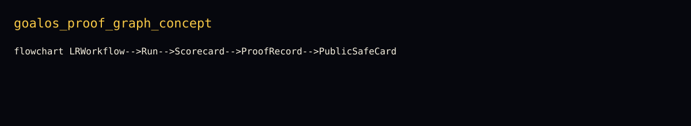

# GoalOS Engineering Roadmap

## Purpose

Set the public engineering roadmap.

## Current status

Current roadmap is proof-first: sell, prove, department RSI, enterprise pilot, then SaaS hardening.

## Key decisions

Phase 1: sell / Proof Card 001. Phase 2: Department RSI. Phase 3: Enterprise RSI Pilot. Phase 4: GoalOS Cloud SaaS. Phase 5: Proof Graph / AEP standardization. Phase 6: partner ecosystem.

## Files involved

- `README.md`
- `docs/data/goalos_catalog.yml`
- `docs/tables/`
- `docs/figures/`
- `scripts/check_no_paid_artifacts.py`
- `scripts/validate_goalos_public_site.py`
- `scripts/validate_docs_tables_figures.py`
- `scripts/validate_goalos_catalog.py`

## What is public

Public: standards, public docs, schemas, examples, public proof pages, public site assets, product names, safe status language, and shop/application links to QUEBEC.AI.

## What must remain private

Private: paid buyer ZIPs, workshop bundles, delivery kits, implementation bundles, enterprise pilot bundles, commercial operating packs, buyer data, private evidence, and private professional-firm package ZIPs.

## Next actions

Maintain validation and paid-file guard while incrementally hardening Cloud MVP.

## Validation checklist

- [ ] Safe AI boundary is present.
- [ ] Product names, prices, and versions match `docs/data/goalos_catalog.yml`.
- [ ] Paid buyer files are not uploaded or linked.
- [ ] Public AEP package allowlist remains `standards/AEP-###/complete-package.zip`.
- [ ] `python scripts/check_no_paid_artifacts.py` passes.
- [ ] `python scripts/validate_docs_tables_figures.py` passes.
- [ ] `python scripts/validate_goalos_catalog.py` passes.

