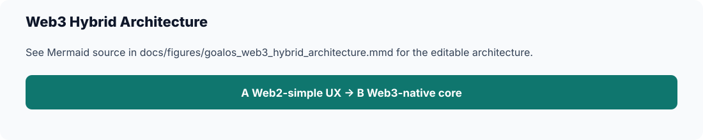

# GoalOS Web3 Hybrid Architecture

## Purpose

Document optional Web3 / AGI.eth / ASI.eth architecture without investment language.

## Current status

Recommended approach: Web3-native core, Web2-simple user experience, no CEX dependency by default, off-chain legal/tax/support controls, and on-chain access/proof/credentials/referrals/treasury routing.

## Key decisions

AGI.eth can support AGI Club membership, community, RSI Lite inclusion, and proof credentials. ASI.eth can support institutional/frontier/enterprise Proof Graph and Enterprise RSI layers. On-chain: membership, access rights, proof-card hashes, credentials, referral attribution. Off-chain: private evidence, buyer data, support tickets, legal/tax decisions, enterprise SOWs.

## Files involved

- `README.md`
- `docs/data/goalos_catalog.yml`
- `docs/tables/`
- `docs/figures/`
- `scripts/check_no_paid_artifacts.py`
- `scripts/validate_goalos_public_site.py`
- `scripts/validate_docs_tables_figures.py`
- `scripts/validate_goalos_catalog.py`

## What is public

Public: standards, public docs, schemas, examples, public proof pages, public site assets, product names, safe status language, and shop/application links to QUEBEC.AI.

## What must remain private

Private: paid buyer ZIPs, workshop bundles, delivery kits, implementation bundles, enterprise pilot bundles, commercial operating packs, buyer data, private evidence, and private professional-firm package ZIPs.

## Next actions

Design proofs and credentials without revenue share, yield, resale, or investment claims.

## Validation checklist

- [ ] Safe AI boundary is present.
- [ ] Product names, prices, and versions match `docs/data/goalos_catalog.yml`.
- [ ] Paid buyer files are not uploaded or linked.
- [ ] Public AEP package allowlist remains `standards/AEP-###/complete-package.zip`.
- [ ] `python scripts/check_no_paid_artifacts.py` passes.
- [ ] `python scripts/validate_docs_tables_figures.py` passes.
- [ ] `python scripts/validate_goalos_catalog.py` passes.

