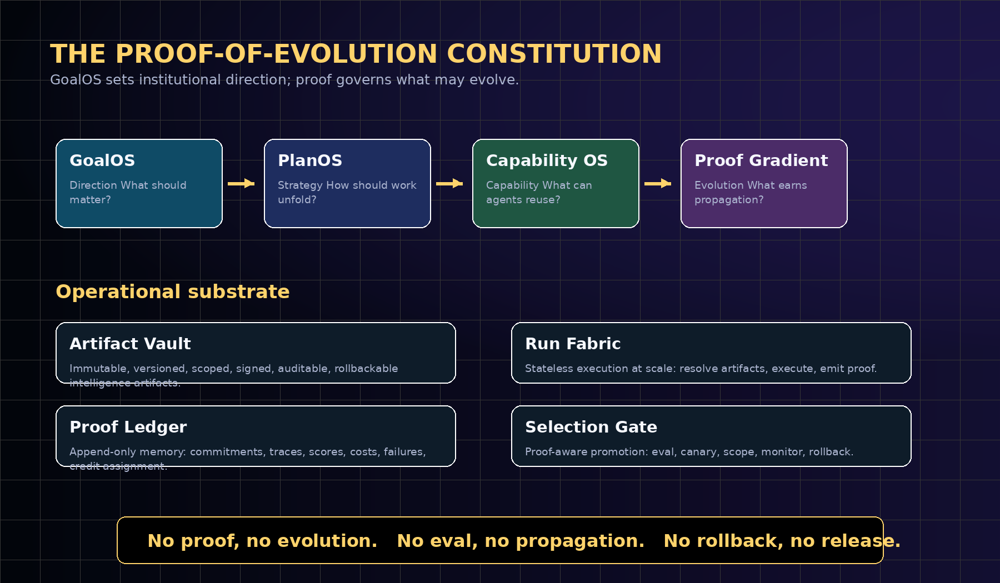
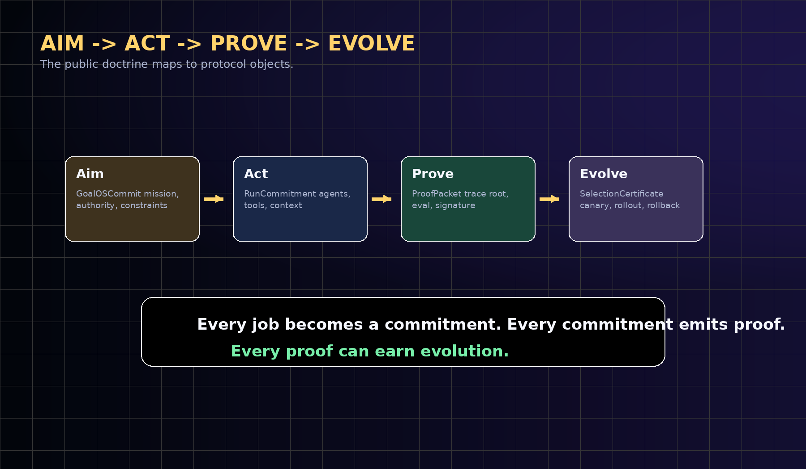
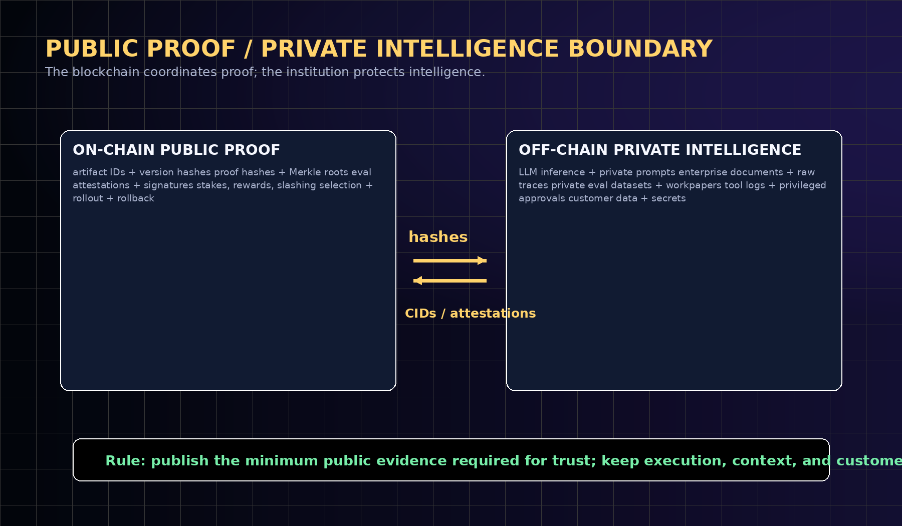
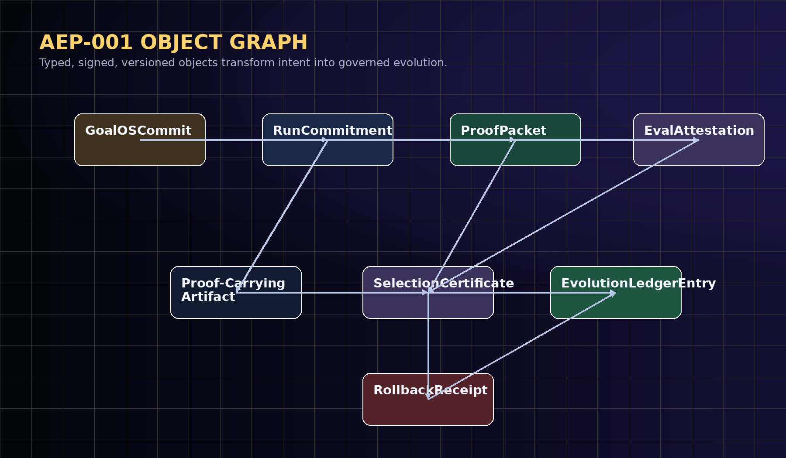
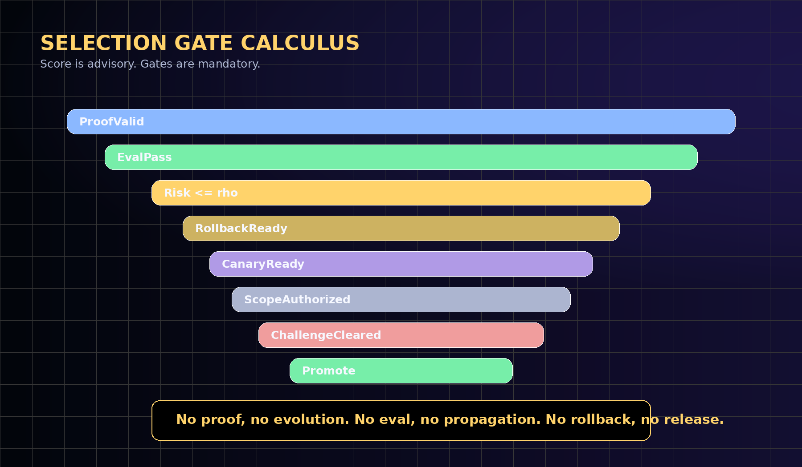
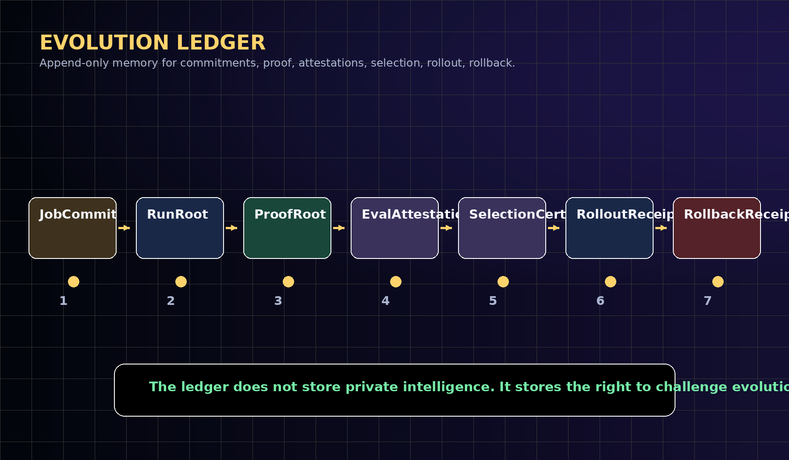
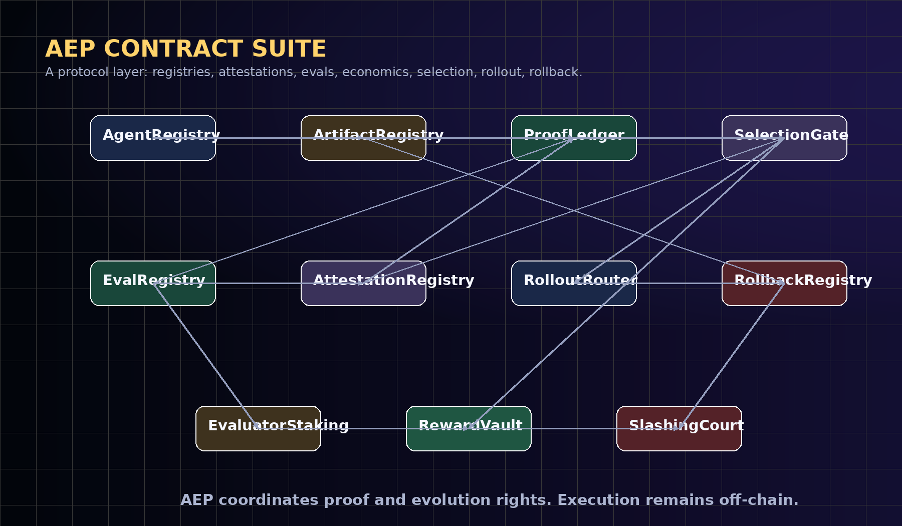
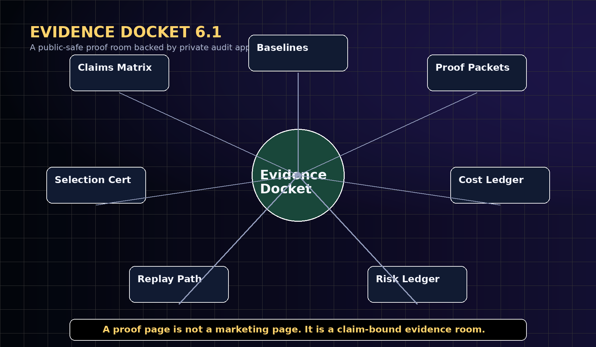
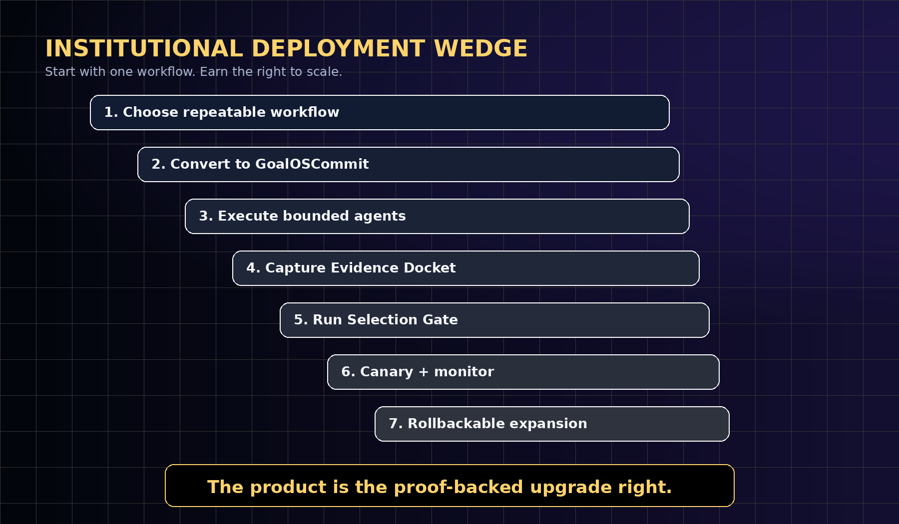

# GoalOS: The Proof-of-Evolution Constitution

## AEP-001: The Blockchain-Native Standard for Proof-Carrying Intelligence Organizations

**v12.1 Institutional Presentation Edition**

**Vincent Boucher**  
President, QUEBEC.AI & MONTREAL.AI | Sovereign AI, AI-First Institutions, AI Governance & Governed Agents  
June 2026

> A model can answer. An agent can act. An institution must prove.

> Do not put intelligence on-chain. Put proof of intelligence on-chain.

> No proof, no evolution. No eval, no propagation. No rollback, no release.

## 1. Abstract

AI systems should not merely act, remember, or self-improve; they should produce evidence sufficient to govern what may improve next. This paper unifies GoalOS, the Agent Evolution Protocol, the Proof Gradient, the Evolution Ledger, and the Evidence Docket into AEP-001: a blockchain-native standard for Proof-Carrying Intelligence Organizations.

The public doctrine is Aim -> Act -> Prove -> Evolve. The protocol object lifecycle is Commit -> Execute -> Prove -> Evolve. GoalOS turns institutional intent into signed, versioned, auditable commitments. The Run Fabric executes bounded agents off-chain. The Proof Ledger and Evolution Ledger record proofs, attestations, selection certificates, rollout receipts, and rollback receipts. The Selection Gate promotes only what survives evidence, evaluation, risk control, canary scope, challenge windows, and rollback readiness.

The core claim is architectural and falsifiable: private intelligence execution should remain off-chain, while public proof commitments, attestations, reputation, and evolution rights can be coordinated on-chain. The paper does not claim achieved AGI, ASI, superintelligence, guaranteed economic return, real-world certification, or civilization-scale capability. It defines the constitutional doctrine, protocol objects, evidence standard, benchmarks, threat model, and commercial deployment path required to test whether agent work can become governed, reusable, compounding institutional capability.

- A model can answer. An agent can act. An institution must prove.
- Do not put intelligence on-chain. Put proof of intelligence on-chain.
- No proof, no evolution. No eval, no propagation. No rollback, no release.

## 2. Reader Map

This edition is designed as both a research paper and an institutional protocol standard. Executives should read the doctrine, commercial primitive, and deployment model. Engineers should read the object model, contract suite, schema, and acceptance tests. Governance readers should read the threat model, claim boundaries, and Evidence Docket standard.

- Executive thesis: why institutions need proof before evolution.
- Constitutional stack: GoalOS, PlanOS, Capability OS, AEP-001, Proof Gradient, and Evolution Ledger.
- Protocol standard: object model, schemas, lifecycle, conformance levels, and acceptance tests.
- Blockchain boundary: on-chain commitments and attestations; off-chain intelligence and private traces.
- Evidence Docket: the institutional proof room for claims, baselines, proof packets, costs, risks, and rollback.
- Commercial deployment: proof-backed upgrade rights as the primitive product.
- Threat model, claim boundaries, and standards roadmap.

## 3. Executive Thesis

Frontier models make action cheap; they do not make institutional trust cheap. The missing layer is not another prompt repository, memory folder, or ungated swarm. The missing layer is an evidential constitution: a machine-checkable system that defines what counts as a valid aim, what counts as execution, what counts as proof, and what earns the right to influence future behavior.

GoalOS is the constitutional Aim layer. It converts strategic intent into signed commitments with success criteria, constraints, authority, risk, budgets, evaluators, and rollback obligations. The Agent Evolution Protocol is the work standard: it turns commitments into executions, executions into proof packets, and proof packets into governed evolution decisions.

The central commercial primitive is the proof-backed upgrade right: the earned, governed right for an artifact to influence future work after passing proof, evaluation, scope control, canary rollout, monitoring, and rollback readiness. This is what makes intelligence reusable without making unverified claims contagious.



## 4. Canonical Contributions

| Contribution | What it establishes | Why it matters |
| --- | --- | --- |
| GoalOS as Constitution | A signed Aim layer for institutional goals, constraints, authority, risk, budget, and evaluators. | Makes organizational intent auditable before agents act. |
| AEP-001 Standard | A formal object model for GoalOSCommit, RunCommitment, ProofPacket, EvalAttestation, SelectionCertificate, RolloutReceipt, RollbackReceipt, Proof-Carrying Artifact, and EvolutionLedgerEntry. | Makes agent evolution implementable and testable. |
| Proof Gradient | A selection law requiring proof, evals, risk controls, canaries, and rollback before propagation. | Separates capability from authority. |
| Evolution Ledger | An append-only blockchain proof layer for commitments, hashes, attestations, selection, rollout, rollback, reputation, rewards, and slashing. | Allows public accountability without public private-data leakage. |
| Evidence Docket 6.1 | A public-private proof room containing claims, baselines, manifests, proof packets, evals, costs, risks, and replay paths. | Turns public proof pages into audit surfaces, not marketing pages. |
| Commercial Deployment Doctrine | One repeatable workflow -> GoalOS commitment -> bounded run -> Evidence Docket -> selected upgrade -> rollbackable expansion. | Gives institutions a practical adoption path. |
| Falsifiable Benchmark Program | GoalOS-Bench, ProofGradient-Bench, ArtifactVault-Bench, RunFabric-Bench, SelectionGate-Bench, EvolutionLedger-Bench, and SovereignPilot-Bench. | Makes the constitution scientific by specifying how it can fail. |

## 5. The Unified Doctrine

The doctrine has two expressions. Publicly, it is Aim -> Act -> Prove -> Evolve. Internally, it is Commit -> Execute -> Prove -> Evolve. These are not competing loops; they are two views of the same protocol.

Aim is the human and institutional layer. Commit is the protocol object. Act is the operational layer. Execute is the runtime event. Prove is the evidential layer. Evolve is the governed propagation layer.



| Public doctrine | Protocol object | Meaning |
| --- | --- | --- |
| Aim | GoalOSCommit | The institution states the mission, authority, constraints, success criteria, risk class, budget, evals, and rollback obligations. |
| Act | RunCommitment | The execution fabric resolves artifacts, agents, tools, context, policies, credentials, and approval rules. |
| Prove | ProofPacket | The run emits trace roots, output hashes, tool decisions, policy decisions, eval results, cost, latency, signatures, and credit assignment. |
| Evolve | SelectionCertificate | The candidate upgrade passes proof integrity, evaluations, risk thresholds, scope, canary, monitoring, and rollback readiness. |

## 6. Design Principles

AEP-001 is deliberately small at the core and strict at the boundary. It scales because execution is stateless, proof is append-only, artifacts are immutable, learning is asynchronous, improvement is gated, propagation is scoped, and rollback is mandatory.

- Proof before propagation. No artifact becomes a network-level upgrade without evidence.
- Private execution, public commitments. Private prompts, traces, customer data, tools, and enterprise documents remain off-chain; public commitments remain verifiable.
- Score is advisory; gates are mandatory. A high score cannot bypass proof validity, eval pass, scope authorization, rollback readiness, or challenge windows.
- Rollback before release. Every promoted upgrade must identify a valid rollback target and monitoring condition.
- Artifact-level credit. Credit and blame attach to goals, plans, capabilities, tools, policies, evals, context recipes, routing rules, and runtime decisions.
- Commercial neutrality. Any model provider, runtime, storage layer, evaluator, chain, enterprise, or sovereign institution can implement AEP if it respects the proof interfaces.
- Claim discipline. Architecture and strategic horizons are not empirical achievements. Claims become empirical only through real tasks, baselines, evidence packets, replay, attestations, safety/cost ledgers, delayed outcomes, and independent review.

## 7. Public-Private Proof Boundary

The boundary is the central safety and scalability decision. Blockchains are useful for shared state, deterministic rules, commitments, settlement, attestations, reputation, and public verification. They are poor places for private prompts, long traces, raw customer data, enterprise documents, and expensive inference.

AEP therefore stores the minimum public evidence required to coordinate trust. Full traces and private execution data stay off-chain. Public proof is represented through hashes, Merkle roots, signatures, attestations, and content-addressed pointers.



| On-chain public proof | Off-chain private intelligence |
| --- | --- |
| artifact IDs, version hashes, content-addressed pointers | LLM inference, private prompts, private context, private documents |
| JobCommit hashes, trace roots, output hashes, policy roots | long traces, raw logs, customer data, sensitive tool outputs |
| EvalAttestations, SelectionCertificates, RolloutReceipts, RollbackReceipts | private evaluation datasets, privileged approvals, internal workpapers |
| staking, rewards, slashing events, reputation roots | secret values, trade secrets, privileged internal rationale |
| public-safe Evidence Docket manifests | private audit appendices available under scoped review |

## 8. AEP-001 Normative Vocabulary

AEP-001 uses standards-style keywords for interoperability. MUST means required for conformance. SHOULD means recommended unless a documented institutional reason exists. MAY means optional. PUBLIC means safe to commit, hash, attest, or expose under the protocol. PRIVATE means kept in controlled storage, disclosed only through scoped audit or verifier mechanisms where available.



| Term | Definition |
| --- | --- |
| GoalOSCommit | The signed institutional Aim object: goal, constraints, authority, risk, budget, evals, allowed tools, and rollback obligations. |
| RunCommitment | The execution contract: agent set, artifact versions, tool permissions, context roots, policies, and budget. |
| ProofPacket | The attestable record of execution: trace root, output hash, evals, policy decisions, cost, latency, signatures, and credit assignment. |
| Proof-Carrying Artifact | Any goal, plan, capability, tool, policy, eval, context recipe, router, or workflow with versioned evidence and rollback metadata. |
| SelectionCertificate | The decision object that admits, rejects, canaries, promotes, pauses, or rolls back a candidate upgrade. |
| EvolutionLedgerEntry | The append-only public record of commitment, proof, attestation, selection, rollout, rollback, and reputation change. |
| Evidence Docket | The institutional proof room tying claims to baselines, proofs, evals, costs, risks, and public/private boundaries. |

## 9. Formal Object Model

Let an institution maintain an artifact universe A, a job stream J, an agent set X, a policy set P, an evaluator set E, a private evidence store V, and a public Evolution Ledger L. A GoalOSCommit is the authority-bearing object that initializes a protocol run.

```text
GoalOSCommit = (
  objective, successCriteria, failureCriteria, constraints,
  authority, riskClass, budget, deadline,
  allowedTools, requiredEvaluators, approvalRules,
  dataBoundary, rollbackObligations, claimBoundary
)

RunCommitment = (
  goalOSCommitHash, agentSet, planGraphHash,
  artifactVersionRoots, toolPermissionRoot,
  contextRoot, policyRoot, runtimeEnvironment,
  budgetLimit, latencyLimit, signerSet
)

ProofPacket = (
  runId, runCommitmentHash, traceRoot, outputHash,
  policyDecisionRoot, toolHistoryRoot,
  evalResultRoot, cost, latency, errors,
  creditAssignment, evidenceURI, signatureBundle
)
```

## 10. Proof-Carrying Artifact Standard

The central object of the system is not an agent and not a model. It is the Proof-Carrying Artifact: any reusable unit of intelligence whose right to propagate is backed by evidence. Artifacts can be goals, plans, capabilities, tools, policies, evals, context recipes, routing rules, approval rules, or workflows.

Each artifact version is immutable. A new version may be proposed, but it cannot become active merely because it sounds better. It must carry proof, be evaluated against a baseline, preserve claim boundaries, include rollback, and pass the Selection Gate.

| Field | Meaning | Institutional value |
| --- | --- | --- |
| artifactId | Stable identifier for the artifact family. | Gives reusable intelligence a durable institutional identity. |
| versionHash | Immutable hash of the released version. | Prevents silent mutation. |
| artifactClass | Goal, plan, capability, tool, policy, eval, context, router, workflow. | Makes credit assignment typed and auditable. |
| proofHistory | References to ProofPackets and EvalAttestations. | Shows why the artifact deserves trust. |
| scope | Tenant, domain, risk class, or rollout scope. | Prevents uncontrolled propagation. |
| rollbackTarget | Safe prior version or recovery procedure. | Makes release reversible. |
| selectionStatus | draft, candidate, canary, active, rejected, rolled_back, deprecated. | Turns lifecycle into governance. |

## 11. The Proof Gradient Selection Law

The Proof Gradient is a selection law, not a vibe, not a popularity contest, and not a marketing score. It is the discipline by which local agent activity becomes institutional evolution. The score is useful, but the hard gates are constitutional.



```text
PG(U) = wq*QualityDelta(U) + wt*Transfer(U) + wv*VerifiedValue(U)
      + wi*EvidenceIntegrity(U)
      - wc*CostDelta(U) - wr*Risk(U) - wo*CoordinationOverhead(U)
      - wb*RollbackDebt(U)

Promote(U) iff
  ProofValid(U)
  AND EvalPass(U)
  AND PG(U) >= theta
  AND Risk(U) <= rho
  AND RollbackReady(U)
  AND CanaryReady(U)
  AND ScopeAuthorized(U)
  AND ChallengeWindowCleared(U)
```

## 12. Evolution Ledger

The Evolution Ledger is the blockchain-native evidence spine. It does not store private intelligence. It stores compact commitments, attestations, decisions, rights, and receipts. Its job is not to know everything; its job is to make institutional evolution challengeable, auditable, and difficult to rewrite.



| Ledger entry | Required public fields | Private counterpart |
| --- | --- | --- |
| JobCommit | commitHash, policyRoot, riskClass, evalRequirements, signer | full goal context, private documents, privileged constraints |
| RunRoot | runId, artifactRoot, traceRoot, outputHash, executionSigner | complete trace, raw logs, tool outputs |
| ProofRoot | proofHash, evidenceURI, evalRoot, cost, latency, signatureBundle | Evidence Docket private appendix |
| EvalAttestation | schemaId, proofRef, baseline, candidate, verdict, evaluator, signature | raw eval data and evaluator workpapers |
| SelectionCertificate | decision, scope, canary, rollbackTarget, challengeWindow | internal rationale and approvals |
| RolloutReceipt | percentage, monitoringRoot, safetyThresholds, signer | tenant-level deployment data |
| RollbackReceipt | rollbackTarget, trigger, status, incidentRoot | incident details and remediations |

## 13. AEP Contract Suite

A practical AEP deployment should be modular. The chain should enforce identities, proofs, attestations, selection, rollout, rollback, reputation, economics, and governance separation. Execution remains off-chain; proof rights are coordinated on-chain.



| Contract | Responsibility |
| --- | --- |
| AgentRegistry | Registers agent identities, operators, delegated permissions, credential roots, and reputation roots. |
| ArtifactRegistry | Registers Proof-Carrying Artifacts and immutable version hashes. |
| RunCommitmentRegistry | Records job/run commitments and public metadata. |
| ProofLedger | Stores proof roots, evidence pointers, signature bundles, and public proof metadata. |
| EvalRegistry | Registers evaluator schemas, baseline suites, acceptance rules, and challenge windows. |
| AttestationRegistry | Records signed claims about runs, evals, policies, selections, and rollbacks. |
| SelectionGate | Applies hard gates, canary policy, monitoring thresholds, and rollback requirements. |
| RolloutRouter | Scopes promotions by tenant, domain, risk class, and rollout percentage. |
| RollbackRegistry | Records rollback targets, triggers, incidents, and recovery receipts. |
| RewardVault | Settles rewards for evaluated improvement, adoption, and public-good eval work. |
| SlashingCourt | Handles fraud, false attestations, evaluator collusion, and challenge resolution. |

## 14. Evidence Docket 6.1

The Evidence Docket is the standard unit of institutional proof. It separates public proof from private intelligence: sensitive traces, customer data, prompts, and tool details can remain private, while commitments, hashes, attestations, scores, and claim boundaries remain auditable.

A proof page is not a marketing page. It should show artifact evidence, run evidence, proof ledger evidence, selection evidence, rollback evidence, security evidence, and claim boundaries. The public viewer should be able to see what was tested, what passed, what failed, which baselines were compared, which gates were enforced, and how to rerun or audit the claim.



| Docket element | Purpose |
| --- | --- |
| Manifest | claim, version, institution, signer, public/private boundary |
| Claims matrix | what is claimed, not claimed, and required evidence |
| Environment | runtime, model/tool permissions, data boundary, policy root |
| Baselines | single agent, memory-only, static workflow, unstructured swarm, incumbent system |
| Proof packets | trace root, output hash, policy decisions, cost, latency, signatures |
| Evaluator attestations | registered eval schemas, results, challenge window, auditor notes |
| Selection certificate | promote/reject, scope, canary, rollback target, monitoring |
| Safety ledger | incidents, blocked actions, unsafe candidates, rollback drills |
| Public report | non-technical explanation with claim boundary and reproducibility path |
| Private appendix | privileged traces, workpapers, confidential evaluator notes under scoped review |

## 15. Flagship Benchmark Suite

A constitution becomes scientific only when it can fail. The flagship benchmark suite evaluates whether evidence-backed evolution works better than static baselines, memory-only baselines, skill-curation-only baselines, unstructured swarms, and ungated self-improvement.

| Benchmark | Tests | Primary metrics |
| --- | --- | --- |
| GoalOS-Bench | Goal specification, revision, auditability, drift resistance | goal drift rate, policy conflicts, approval trace completeness |
| ProofGradient-Bench | Prediction of useful upgrades from proof packets | holdout uplift, false promotion, negative-control rejection |
| ArtifactVault-Bench | Reusable artifact transfer with provenance and rollback | transfer score, dependency integrity, rollback success |
| RunFabric-Bench | Stateless execution and proof capture at scale | throughput, cost, trace completeness, failure recovery |
| SelectionGate-Bench | Promotion discipline under adversarial candidates | unsafe rejection, challenge success, canary precision |
| EvolutionLedger-Bench | Public proof with private intelligence preserved | redaction safety, audit quality, challengeability, ledger consistency |
| SovereignPilot-Bench | Institutional deployment without private leakage | public/private separation, governance audit, user comprehension |

## 16. Commercial Deployment Doctrine

The first commercial deployment should not sell unrestricted autonomy. It should sell governed improvement: evidence-backed capability adoption under enterprise and sovereign controls.

The deployment wedge is simple. Choose one repeatable workflow. Convert it into GoalOS commitments. Execute with bounded agents. Capture proof. Extract reusable artifacts. Run the Selection Gate. Publish a public-safe proof room. Keep private intelligence private. Repeat until the organization can measure whether work is becoming reusable capability.

Commercial products can include enterprise evidence vaults, proof-backed procurement records, auditor-ready AI operation rooms, capability markets, evaluator markets, artifact licensing, agent reputation profiles, sovereign proof commons, and regulated propagation gates. The enduring moat is not a demo; it is the evidence graph of what actually works.



## 17. Threat Model

AEP assumes agents, users, evaluators, and operators may be mistaken, adversarial, collusive, or incentive-misaligned. The protocol therefore treats proof integrity, privacy, evaluation robustness, and rollback as first-class security properties.

| Threat | Failure mode | Mitigation |
| --- | --- | --- |
| False proof | An agent submits forged or incomplete evidence. | signature verification, trace roots, replay, challenge windows, evaluator attestations |
| Evaluator collusion | Evaluators approve weak artifacts. | staking, slashing, diverse evaluators, random audits, independent challenge markets |
| Reward hacking | Artifacts optimize the score rather than institutional value. | negative controls, held-out tasks, delayed outcomes, hard gates, human escalation |
| Privacy leakage | Public proof reveals private prompts, data, or customer context. | redaction, public/private dockets, content hashes, scoped audit, data-boundary tests |
| Governance capture | Token votes or insiders bypass evidence. | governance separation, proof-required execution, challenge rights, emergency pause |
| Rollback failure | A promoted artifact cannot be safely reverted. | rollback targets, canary stages, monitoring thresholds, rollback drills |
| Overclaiming | Strategic scenarios are presented as achieved facts. | claim-boundary ledger, legal review, empirical evidence thresholds |

## 18. Conformance Levels

AEP-001 can be adopted incrementally. The lowest levels validate object structure; the highest levels support cross-institutional proof, independent challenge, and governed economic settlement.

| Level | Name | Requirement |
| --- | --- | --- |
| L0 | Schema-valid | Objects validate against AEP-001 schemas. |
| L1 | Proof-emitting | Runs produce ProofPackets with trace roots, output hashes, cost, latency, signatures. |
| L2 | Eval-gated | Candidate upgrades require registered evals and baseline comparisons. |
| L3 | Rollbackable | Every promoted upgrade includes a rollback target and monitoring conditions. |
| L4 | Attestable | Independent evaluators and auditors can sign EvalAttestations and SelectionCertificates. |
| L5 | Production-governed | Canary rollout, challenge windows, incident logs, and governance separation are enforced. |
| L6 | Cross-institutional | Proof-Carrying Artifacts can be adopted across institutions without exposing private intelligence. |

## 19. Falsification and Acceptance Tests

The strongest version of this research program is adversarial. It should publish negative controls, failed upgrades, rejected candidates, rollback events, and delayed-outcome failures. A system that hides failure cannot be a proof system.

| Falsification condition | Meaning |
| --- | --- |
| Proof is not predictive | Proof packets fail to identify upgrades that improve hidden future tasks. |
| Baselines win | Accepted artifacts do not beat strong static, memory, curation, or swarm baselines under equal budget. |
| Gate is gameable | Candidates exploit proxy metrics or evaluator weaknesses. |
| Rollback fails | Promoted upgrades cannot be safely reverted or scoped. |
| Evidence is unreplayable | Dockets cannot be independently inspected, replayed, or audited. |
| Overhead dominates | Coordination, validation, and governance cost exceed verified value. |
| Privacy boundary breaks | Public proof leaks private intelligence or customer data. |

## 20. Claim Boundaries and Governance

This paper does not claim achieved AGI, ASI, superintelligence, autonomous sovereignty, guaranteed ROI, investment returns, legal advice, financial advice, medical advice, policy advice, safety certification, external customer production results, energy abundance, or Kardashev Type II achievement.

It claims a protocol architecture and a falsifiable research program. The claim becomes empirical only through real tasks, strong baselines, proof packets, replay, evaluator attestations, safety ledgers, cost ledgers, delayed-outcome checks, and independent review.

Civilization-scale language is a strategic horizon, not a present-tense claim. The measurable near-term claim is governed improvement: verified work becoming reusable capability under evidence, evaluation, rollout, and rollback.

## 21. One-Page Constitution

Aim. Act. Prove. Evolve. GoalOS gives the network direction. PlanOS gives it strategy. Capability OS gives it capability. The Proof Gradient gives it evolution. The Artifact Vault stores reusable intelligence. The Run Fabric executes agents at scale. The Proof Ledger records what happened. The Selection Gate promotes only what proved itself.

Every agent acts once. The network learns forever. A model can answer. An agent can act. An institution must prove. No proof, no evolution. No eval, no propagation. No rollback, no release.

## 22. Conclusion

The next frontier is not merely larger models, better agents, or larger repositories. The next frontier is evidential intelligence: institutions whose agents may act, but whose improvements must prove themselves before they propagate.

GoalOS defines what the institution is trying to become. AEP-001 defines how work becomes proof. The Proof Gradient defines what earns evolution. The Evolution Ledger makes that evolution verifiable across networks. The Evidence Docket makes claims auditable. The Selection Gate makes propagation safe.

The constitutional statement is short enough to remember and strict enough to implement: Aim. Act. Prove. Evolve. A model can answer. An agent can act. An institution must prove.

## References

- Boucher, V. (2026a). AGI ALPHA: A Scalable Substrate for Intelligence Organizations. Manuscript draft. Used for organizational-substrate lineage, Evidence Docket discipline, proof bundles, replay logs, safety/cost ledgers, and governed recursive improvement. Token-related material is intentionally excluded.
- Boucher, V. (2026b). GoalOS: The Proof Gradient Constitution. Manuscript draft. Used for constitutional doctrine, canonical law, proof-backed upgrade rights, benchmark suite, and commercial deployment model.
- Ethereum Foundation. (2026). Ethereum smart contracts documentation.
- Solidity Documentation. (2026). Solidity language documentation.
- Ethereum Attestation Service. (2026). Attestation protocol documentation.
- IPFS Documentation. (2026). Content addressing and CID documentation.
- Ethereum Improvement Proposal ERC-4337. (2026). Account abstraction via EntryPoint contract specification.
- Ethereum Improvement Proposal ERC-6551. (2026). Token-bound accounts specification.
- Chainlink Documentation. (2026). Functions and CCIP documentation.
- OpenZeppelin Contracts. (2026). Governor and governance contracts documentation.
- W3C. (2025). Verifiable Credentials Data Model v2.0.
- NIST. (2023). Artificial Intelligence Risk Management Framework 1.0.
- NIST. (2024). Artificial Intelligence Risk Management Framework: Generative AI Profile.
- OWASP. (2026). Agentic AI threat modeling and securing agentic applications guidance.
- Necula, G. C. (1997). Proof-carrying code. Proceedings of POPL.
